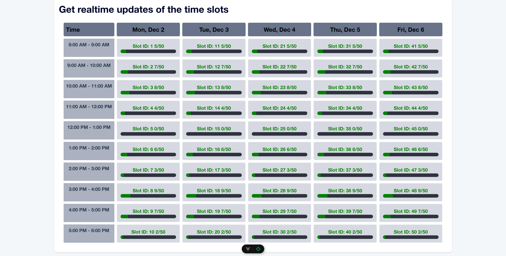
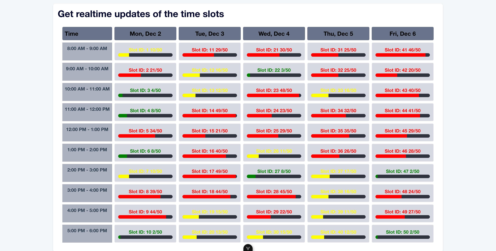

# Conroo Code Challenge (Time Slots Dashboard)

This is a simple web application that displays and dynamically updates the capacity and category of time slots for reservations based on incoming events in real time.

## Features

- Real-time updates of time slot capacities
- Visual status indicators (green, yellow, red) based on capacity that are updated in real time
- Progress bar visualization for capacity levels
- Unit tests

## Prerequisites

- Node.js (v16 or higher)
- npm
- Modern web browser

## Project Setup Instructions

1. Clone the repo

```sh
git clone https://github.com/KelvinNjihia/conroo-code-challenge.git
```

2. Navigate to the project directory

```sh
cd conroo-code-challenge
```

3. Run the following command to install the dependencies:

```sh
npm install
```

4. Start the development server

```sh
npm run dev
```

5. (Optional) Run Unit Tests with Vitest

```sh
npm run test:unit
```

6. Open the application in your browser

```sh
http://localhost:5173
```

## Technical Design

### Technical Stack and Architecture

- `Vue 3` (Composition API), `TypeScript`
- `Pinia` - State Management
- `Bulma` - CSS Framework
- `Vitest` - Unit Testing
- `Vite` - Build Tool

### Why Pinia?

- I selected Pinia for state management due to its TypeScript support and Vue 3 integration
- It's simple and easy to use and it's a good fit for this project.

### Why Bulma?

- Bulma is a CSS framework for base components.
- It exposes a lot of the CSS classes that I needed for this project such as `progress` that I needed to visually represent the capacity of the time slots.
- It also works well and out of the box and very light weight and easy to set up.

### Why Vitest?

- Vitest is a unit testing library that I've used in the past and it's a good fit for this project.
- It's simple and easy to use and it's a good fit for this project.

### Why Vite?

- Vite is a build tool that I've used in the past and it's a good fit for this project.
- It's simple and easy to use and it's a good fit for this project since it's a single page application.

## UI Design (Grid Layout)

### Why a weekly grid layout?

- Fixed 5 days (Mon-Fri)
- Fixed hours (8am-6pm) - 10 hours per day. However I've set it up such that if there are different hours for different days, it will still work.
- User Experience:
  - No hidden information
- Easy to scan and compare times
- Natural "schedule" format that most people understand
- Users likely want to compare slots across days
- Easier to spot patterns (like "all morning slots are open")
- Better for capacity planning

### Project Screenshots

- On initial load, the application will display the current week's schedule as available on `/timeSlots` endpoint.
  
- The schedule is displayed in a grid layout with 5 days and 10 hours per day.

- The schedule is dynamically updated when an event is received from the `/sse` endpoint.

  
